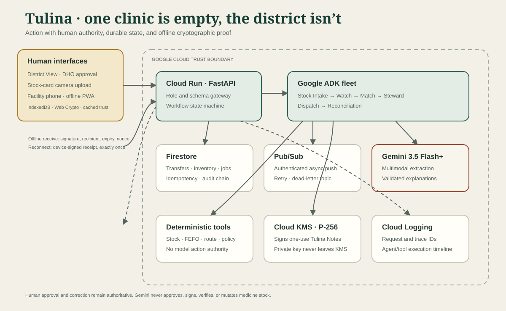

# Tulina

**One clinic is empty. The district isn’t.**

Tulina is an installable medicine-redistribution PWA for district health teams. Background Google ADK agents discover shortages and safe nearby surplus, deterministic policy tools propose a transfer, a District Health Officer approves it, and a signed one-use Tulina Note proves delivery even when the receiving phone is offline.

The acceptance story is transfer `TR-027`: 11 packs of synthetic oxytocin stock move from Mbale Regional Referral Hospital to Busiu Health Centre IV. All stock values are research-grade synthetic fixtures—not current facility data. Tulina contains no patient data.

## Five-minute local setup on Windows

Prerequisites: Python 3.12+, Node.js 22+, npm, and Google Chrome. Fixture mode needs no API key, cloud account, or paid service.

From Windows CMD:

```cmd
cd /d "C:\Users\X1 Yoga\Documents\Codex\2026-08-09\tulina"
copy .env.example .env
powershell.exe -NoProfile -ExecutionPolicy Bypass -File ".\scripts\setup.ps1"
powershell.exe -NoProfile -ExecutionPolicy Bypass -File ".\scripts\dev.ps1"
```

Open [http://localhost:5173/judge](http://localhost:5173/judge), select **Reset demo**, and follow **Next moment**. The API runs at `http://localhost:8080`; readiness is visible at `/readyz`.

PowerShell users may run:

```powershell
Copy-Item .env.example .env
.\scripts\setup.ps1
.\scripts\dev.ps1
```

## Verification

The release gate verifies fixture hashes, secrets, Python lint, backend tests, component/protocol tests, the production PWA build, bundle budgets, and four real-browser tests covering the full offline story, axe accessibility, failure recovery, and a 390 px facility phone.

```cmd
cd /d "C:\Users\X1 Yoga\Documents\Codex\2026-08-09\tulina"
powershell.exe -NoProfile -ExecutionPolicy Bypass -File ".\scripts\test.ps1"
```

Run only the browser journey:

```cmd
powershell.exe -NoProfile -ExecutionPolicy Bypass -File ".\scripts\e2e.ps1" -BrowserChannel "chrome"
```

On Linux/CI, install Playwright Chromium once and run `npm --prefix frontend run test:e2e`. Failure traces and screenshots stay under ignored `frontend/test-results/`.

## Runtime modes and environment variables

Copy `.env.example` to `.env`; never commit `.env`.

| Mode | Required values | What it proves |
|---|---|---|
| Fixture | `TULINA_MODE=fixture`, local repository and queue | Full deterministic demo with saved extraction; never claims Gemini or GCP ran |
| Gemini API | `TULINA_MODE=gemini`, `GOOGLE_API_KEY`, `GEMINI_MODEL=gemini-3.5-flash` or newer | Live multimodal extraction and structured explanations |
| Vertex AI | Gemini mode plus `GOOGLE_GENAI_USE_VERTEXAI=true`, project and location | Gemini through the selected Google Cloud project |
| GCP | `TULINA_MODE=gcp`, Firestore, Pub/Sub identity/audience, project, Vertex AI, full KMS key version | Managed persistence, authenticated async delivery, Gemini, and non-exportable signing |

Startup rejects missing cloud identity, Firestore/KMS configuration, or Gemini models older than 3.5. See [.env.example](.env.example) for every variable and [the credential checklist](docs/CREDENTIAL_CHECKLIST.md) before recording the cloud proof.

## What is implemented

- A real Google ADK parent fleet with Stock Intake, Watch, Match, Steward, Dispatch, and Reconciliation agents. Queued work returns HTTP 202 and persists each agent/tool step.
- Gemini structured vision for stock-card photos plus a digest-bound fixture provider. Confidence, evidence, registry resolution, injection isolation, correction, and human confirmation are visible.
- Deterministic stock arithmetic, donor-cover floors, FEFO expiry priority, route, cold-chain, care-level policy, workflow transitions, and human-only approval.
- P-256 Tulina Notes, QR camera/file scan, cached public trust, offline Web Crypto verification, a non-exportable device key, IndexedDB receipts, and reconnect sync.
- Exactly-once reconciliation. Duplicate receipt retries apply zero. Changed quantities, replay, wrong recipient, expiry, unknown issuer, malformed payloads, and conflicts fail closed or enter human review.
- Server-side role permissions, redacted hash-chained audit events, correlation IDs, prompt/tool-output guards, structured JSON logs, health/readiness, and durable exception review.
- Cloud Run, Firestore transactions, authenticated Pub/Sub push, Vertex AI/Gemini, Cloud KMS signing, separate least-privilege identities, scale-to-zero limits, and guarded deployment/teardown scripts.

Gemini never approves or executes a medicine move. Models interpret images and explain validated facts; deterministic tools, cryptography, repositories, and named humans retain authority.

## Google Cloud deployment

Prerequisites: a billing-enabled Google Cloud project, current `gcloud`, and permission to enable APIs and create the documented resources.

```cmd
cd /d "C:\Users\X1 Yoga\Documents\Codex\2026-08-09\tulina"
gcloud auth login
gcloud auth application-default login
powershell.exe -NoProfile -ExecutionPolicy Bypass -File ".\infra\gcp\deploy.ps1" -ProjectId "YOUR_PROJECT_ID"
powershell.exe -NoProfile -ExecutionPolicy Bypass -File ".\infra\gcp\verify.ps1" -ProjectId "YOUR_PROJECT_ID"
```

The deploy script creates the two Cloud Run services, Artifact Registry images, delete-protected Firestore database and indexes, Pub/Sub topics/subscription, service identities, and P-256 Cloud KMS key. It does not create a project, save service-account keys, or delete durable Firestore/KMS data.

Read [the complete deployment guide](docs/DEPLOYMENT_GCP.md), [IAM matrix](docs/IAM_GCP.md), and [cost controls](docs/COST_CONTROL.md). External deployment is a credential-only step; the repository does not fabricate a `.run.app` URL or cloud log.

## Architecture and repository map



- `backend/` — FastAPI, domain engine, Google ADK fleet, security protocol, local and Google Cloud adapters.
- `frontend/` — React/TypeScript installable PWA, IndexedDB/Web Crypto offline layer, Playwright E2E.
- `contracts/v1/` — versioned schemas crossing browser, API, agent, Pub/Sub, and audit boundaries.
- `data/fixtures/` — imported read-only synthetic source pack with preserved IDs and cryptographic fixtures.
- `infra/gcp/` — Cloud Run, Firestore, Pub/Sub, IAM, Cloud KMS, verification, seed, and guarded teardown.
- `docs/` — architecture, security, operations, QA, four-minute demo, and submission packet.

See [the Mermaid architecture](docs/ARCHITECTURE.md), [agent fleet](docs/AGENT_FLEET.md), [security model](docs/SECURITY.md), [offline protocol](docs/OFFLINE_PROTOCOL.md), [QA report](docs/QA_REPORT.md), and [four-minute demo script](docs/DEMO_SCRIPT_4_MIN.md).

## Submission links

- Repository: [github.com/NestroyMusoke/TULINA](https://github.com/NestroyMusoke/TULINA)
- Hosted project: add after the credentialed Cloud Run deployment
- Demo video: add after recording the verified four-minute path
- Devpost draft: [docs/DEVPOST_SUBMISSION.md](docs/DEVPOST_SUBMISSION.md)

Licensed under [MIT](LICENSE).
