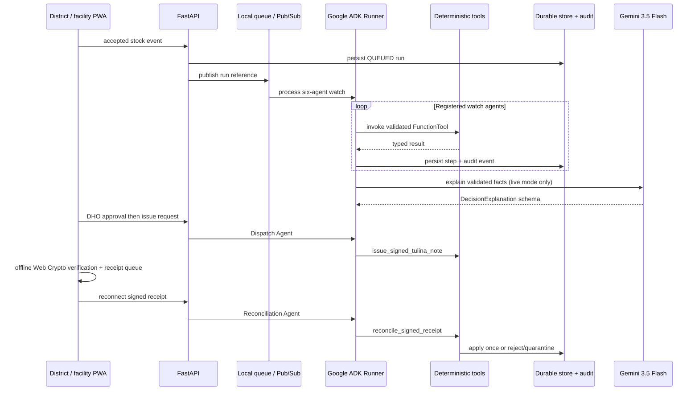

# Tulina agent fleet

Phases 3–5 implement a real Google ADK hierarchy that starts from accepted inventory events, schedules, signed dispatch requests, or queued receipts—not a chat prompt. Companion ADK runners handle multimodal intake, signed dispatch, and receipt reconciliation around the district watch fleet. Local demo and Google Cloud modes use the same contracts.

## Runtime flow

## Responsibilities and authority

| ADK agent | Tool | Durable evidence | Authority boundary |
|---|---|---|---|
| `stock_intake_agent` | `extract_stock_card`, `validate_inventory_snapshot` | observation, confidence, evidence, source label, record count | Requires correction/confirmation; cannot mutate inventory |
| `watch_agent` | `detect_stock_signals` | need/offer counts and focus cover | Reads stock; cannot propose a donor alone |
| `match_agent` | `rank_safe_transfers` | candidates and validated recommendation | Proposes only; cannot approve or mutate |
| `steward_agent` | `evaluate_governance` | five policy gates and concise explanation | Blocks unsafe proposals; cannot grant human authority |
| `dispatch_agent` | `check_dispatch_gate`, `issue_signed_tulina_note` | gate result, signed note ID/key, workflow events | Issues only after recorded DHO approval; the model never signs |
| `reconciliation_agent` | `check_reconciliation_gate`, `reconcile_signed_receipt` | decision, mutation count, before/after stock, audit event | Deterministic verification only; conflict quarantines and duplicate applies zero |

## Asynchronous and persistent behavior

- `POST /api/v1/agent-runs/watch` writes a `QUEUED` run and returns HTTP 202.
- Local mode processes through a FastAPI background task; `POST /api/v1/agent-worker/process-next` resumes the next queued job after restart.
- Pub/Sub mode publishes only a versioned durable run record. Cloud Run push wiring arrives in Phase 7.
- SQLite retains agent runs, tool steps, notes, public device registrations, receipts, nonces, reconciliation results, inventory mutations, and hash-chained audit events.
- ADK sessions are invocation-scoped. Hidden reasoning and prompts are not durable operational state.

## Provider modes

- `fixture`: no key required. ADK and deterministic tools run; saved explanation/extraction records clearly state Gemini was not called.
- `gemini`: requires `GOOGLE_API_KEY`; uses `gemini-3.5-flash` or newer.
- `gcp`: requires `GOOGLE_CLOUD_PROJECT`; uses Vertex AI with the same model contracts.

Startup rejects an unversioned or old Gemini model, missing live credentials, or Pub/Sub mode without a project ID.

## Proof hooks

- `GET /api/v1/agent-registry` — Google ADK version, six agents, tools, provider, model, and queue.
- `GET /api/v1/agent-runs/{run_id}` — durable watch run and tool-step timeline.
- `GET /api/v1/activity` — `ADK_DISPATCH_COMPLETED` and `ADK_RECONCILIATION_COMPLETED` with tool names and mutation counts.
- `python -m backend.tulina.agents.cli --reset` — non-chat scheduled execution for CI and video evidence.

## Honest current limits

Live Gemini requires credentials and is covered locally by schema-validation adapter tests, never a fabricated network response. Fixture vision replay is bound to the supplied image digest. Local reconciliation is serialized within one process; Phase 7 replaces that boundary with Firestore transactions, Cloud Run, Pub/Sub subscriptions, and optional Cloud KMS signing.
