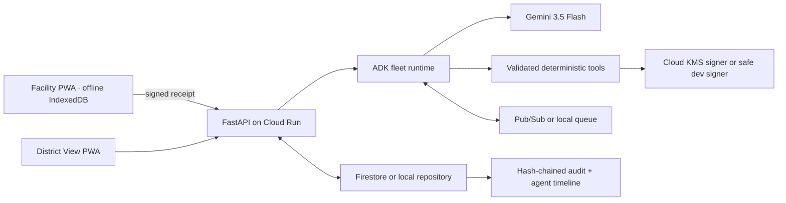

# Architecture

Tulina is a Vite/React PWA backed by Python 3.12/FastAPI. A repository port selects local SQLite-like fixture persistence or Firestore. A queue port selects an in-process durable demo queue or Pub/Sub. Google ADK coordinates six agents; every proposed action crosses validated Pydantic contracts and deterministic tools before it can change workflow state.

## Fleet responsibilities

| Agent | Invokes | Asynchronous responsibility | Durable output |
|---|---|---|---|
| Stock Intake | Gemini vision, schema validator | Extract stock-card observations | observation + evidence + confidence |
| Watch | coverage and expiry tools | Detect shortage/surplus windows | finding |
| Match | quantity, route, cold-chain tools | Rank safe transfers | recommendation |
| Steward | policy and authorization tools | Block unsafe proposals; request DHO decision | approval request or exception |
| Dispatch | signer and trust bundle | Issue one-use Tulina Note after approval | signed note + nonce |
| Reconciliation | verifier and idempotent mutation | Apply valid receipts once; quarantine conflicts | receipt result + inventory event |

Humans retain correction authority for uncertain intake and sole approval authority for transfers.

