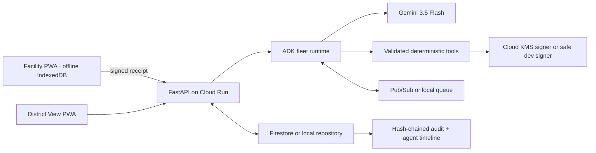

# Architecture

Tulina is a Vite/React PWA backed by Python 3.12/FastAPI. A repository port selects local SQLite-like fixture persistence or Firestore. A queue port selects an in-process durable demo queue or Pub/Sub. Google ADK coordinates six agents; every proposed action crosses validated Pydantic contracts and deterministic tools before it can change workflow state.

## Fleet responsibilities

| Agent | Invokes | Asynchronous responsibility | Durable output |
|---|---|---|---|
| Stock Intake | Gemini vision, schema validator | Extract stock-card observations | observation + evidence + confidence |
| Watch | coverage and expiry tools | Detect shortage/surplus windows | finding |
| Match | quantity, route, cold-chain tools | Rank safe transfers | recommendation |
| Steward | policy and authorization tools | Block unsafe proposals; request DHO decision | approval request or exception |
| Dispatch | signer and trust bundle | Issue one-use Tulina Note after approval | signed note + nonce |
| Reconciliation | verifier and idempotent mutation | Apply valid receipts once; quarantine conflicts | receipt result + inventory event |

Humans retain correction authority for uncertain intake and sole approval authority for transfers.

## Phase 1 implementation boundary

The domain package is independent of FastAPI, Gemini, ADK, and GCP credentials. Pydantic models mirror the language-neutral JSON Schemas in `contracts/v1`. The `DomainEngine` converts private fixture records into stock positions, watch signals, policy decisions, ranked recommendations, and metrics. `SQLiteRepository` is the durable local adapter and provides transactionally consistent state, idempotency, and hash-chained audit history. Firestore and Pub/Sub adapters arrive with the asynchronous agent phase without changing these rules.

## Phase 2 implementation boundary

FastAPI now exposes the derived district overview, network positions, activity history, deterministic demo reset, discovery, approval request, and DHO approval. The React PWA consumes those endpoints through a typed service layer. The interface never calculates or embeds the TR-027 outcome: it renders the repository state produced by the Phase 1 domain engine.

The Judge Demo is an orchestrated UI over real operations. Its four current moments end at human approval; signing, offline receipt, and reconciliation are intentionally reserved for Phase 5. Demo headers make authorization visible, while the server remains the source of truth for permitted roles and workflow transitions.
