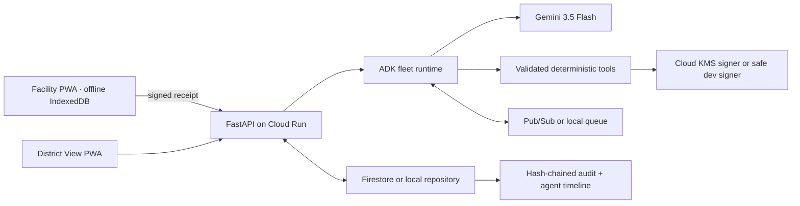

# Architecture

Tulina is a Vite/React PWA backed by Python 3.12/FastAPI. A repository port selects local SQLite-like fixture persistence or Firestore. A queue port selects an in-process durable demo queue or Pub/Sub. Google ADK coordinates six agents; every proposed action crosses validated Pydantic contracts and deterministic tools before it can change workflow state.

## Fleet responsibilities

| Agent | Invokes | Asynchronous responsibility | Durable output |
|---|---|---|---|
| Stock Intake | Gemini vision, schema validator | Extract stock-card observations | observation + evidence + confidence |
| Watch | coverage and expiry tools | Detect shortage/surplus windows | finding |
| Match | quantity, route, cold-chain tools | Rank safe transfers | recommendation |
| Steward | policy and authorization tools | Block unsafe proposals; request DHO decision | approval request or exception |
| Dispatch | signer and trust bundle | Issue one-use Tulina Note after approval | signed note + nonce |
| Reconciliation | verifier and idempotent mutation | Apply valid receipts once; quarantine conflicts | receipt result + inventory event |

Humans retain correction authority for uncertain intake and sole approval authority for transfers.

## Phase 1 implementation boundary

The domain package is independent of FastAPI, Gemini, ADK, and GCP credentials. Pydantic models mirror the language-neutral JSON Schemas in `contracts/v1`. The `DomainEngine` converts private fixture records into stock positions, watch signals, policy decisions, ranked recommendations, and metrics. `SQLiteRepository` is the durable local adapter and provides transactionally consistent state, idempotency, and hash-chained audit history. Firestore and Pub/Sub adapters arrive with the asynchronous agent phase without changing these rules.

## Phase 2 implementation boundary

FastAPI now exposes the derived district overview, network positions, activity history, deterministic demo reset, discovery, approval request, and DHO approval. The React PWA consumes those endpoints through a typed service layer. The interface never calculates or embeds the TR-027 outcome: it renders the repository state produced by the Phase 1 domain engine.

The Judge Demo is an orchestrated UI over real operations. Demo headers make authorization visible, while the server remains the source of truth for permitted roles and workflow transitions.

## Phase 3 implementation boundary

`tulina_fleet` is a real Google ADK parent agent with six registered `BaseAgent` children. ADK's `Runner` invokes them in an explicit sequence and shares only validated invocation state. Every child calls a named ADK `FunctionTool`; tool outputs cross strict Pydantic boundaries before becoming durable state or UI evidence.

FastAPI accepts a versioned watch request, persists it as `QUEUED`, returns HTTP 202, and processes local jobs after the response. The PWA polls the durable run and renders partial agent/tool progress. Pub/Sub mode publishes the same run record for a Cloud Run worker. SQLite persists authoritative job and step state; ADK's in-memory session is invocation-scoped and is not treated as the system of record.

Gemini is deliberately outside the action boundary. In live mode it receives only validated recommendation facts and returns a `DecisionExplanation`; it cannot approve, dispatch, or mutate inventory. Fixture mode returns the same schema without credentials and the agent registry explicitly reports that no Gemini call occurred.

## Phase 4 implementation boundary

Camera and file uploads enter a dedicated ADK `stock_intake_agent`, which invokes the `extract_stock_card` function tool. The tool selects either the Gemini multimodal provider or the saved fixture provider, validates the structured result, resolves facility/product/batch IDs against registries, and persists an intake record. The ADK session is deleted after each invocation, so raw image bytes are not retained in application state; only the filename, MIME type, size, SHA-256 digest, structured extraction, evidence, and corrections remain.

The fixture provider is bound to the supplied synthetic PNG digest and refuses any other image instead of pretending it performed vision. Gemini output crosses the same `RawStockCardExtraction` contract. Confidence below 0.85, missing evidence, unknown identities, ledger inconsistencies, batch/expiry conflicts, or storage-range conflicts move the record to `NEEDS_REVIEW`. A facility worker must correct those fields and explicitly accept every observation before an `inventory_event` may start the district watch.

## Phase 5 implementation boundary

Dispatch and reconciliation are dedicated real ADK agent invocations over validated function tools. Models never sign, approve, verify, or mutate medicine. `ProtocolService` owns canonical encoding, P-256 checks, identity binding, replay decisions, and reconciliation; `SQLiteProtocolStore` persists local issuer identity, notes, registered public device keys, receipts, consumed nonces, and outcomes.

The facility PWA caches only public issuer trust in IndexedDB and keeps its non-exportable Web Crypto private key locally. Offline scanning uses Web Crypto and a local nonce set without calling FastAPI or Gemini. Reconnection uploads the signed receipt; the repository transaction and idempotency ledger apply at most one inventory mutation. A cloud-state conflict is quarantined instead of merged.
